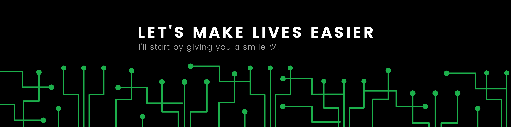

## >Hello There!_
I'm Denn Agustin, a Full-Stack Software Engineer who loves coffee, music, poetry, software development, and anime ツ 🤍. 

I'm fueled by my core values, such as consistency, good humor, perseverance, respect, and commitment. I am a 'lifelong learner,' eager to build myself more in personal and professional development.

Additionally, I believe that working smarter is the key to success, and purpose fuels passion.

If you want to contact me or have any questions, connect with me using the buttons below. I'd love to hear from you.

## Let’s Connect

## Tools and Technologies
###### Front-End

###### Back-End

###### Database

###### IDE & Code Editor

###### Others

## Support Me
If you want to support me, you can buy me a coffee using the buttons below. I will use the funds to buy a PC to help me create free online courses about developing applications. Thank you so much!

